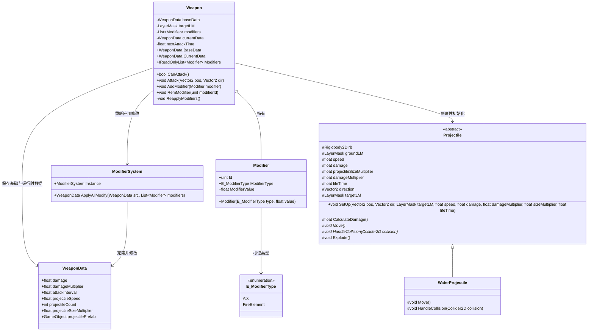
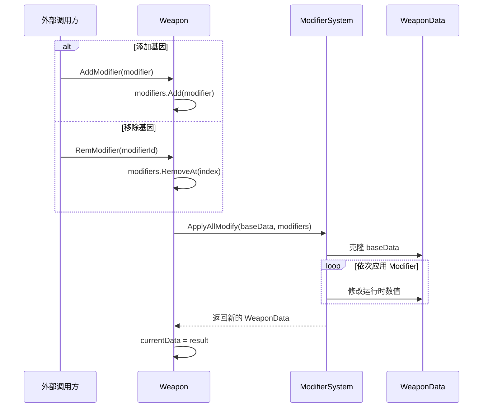
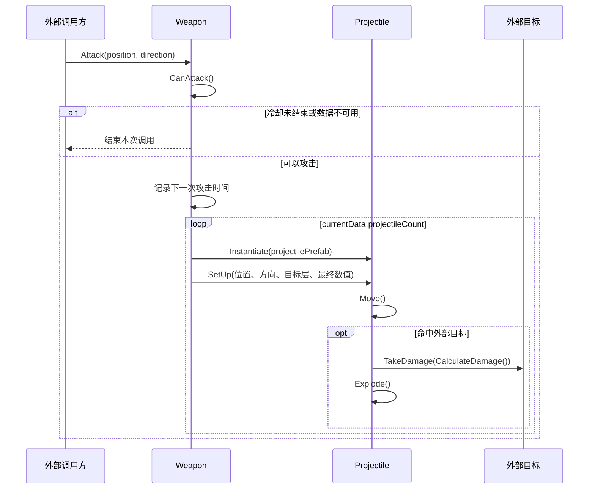

# BattleSystem 战斗系统

## 1. 当前设计范围

仅包含：

> ### 玩家使用一种基础攻击，通过添加或移除基因对应的 `Modifier`，重新计算武器运行时数据，并使用最终数据发射子弹。

未加入：

- 基因树结构；
- 主动技能；
- 基因获取、解锁与升级方式；
- 未确定的元素融合与特殊发射规则。

## 2. Battle 模块层级划分

```text
BattleSystem
│
├── Weapon
│   ├── Weapon
│   └── WeaponData
│
├── Modifier
│   ├── Modify
│   ├── ValueModify
│   ├── ElementModify
│   └── ModifierSystem
│
└── Projectile
    ├── Projectile
    └── WaterProjectile
```

## 3. 模块职责

### Weapon

负责保存基础武器数据、当前运行时数据和已装配的 Modifier，并执行一次攻击。

- `AddModifier`、`RemModifier` 后重新应用全部 Modifier；
- 根据攻击冷却判断是否可以攻击；
- 根据最终的 `WeaponData` 创建指定数量的 Projectile；
- 将方向、伤害、速度、大小和目标层传给 Projectile。

### WeaponData

负责保存可配置的武器数据。

- 基础伤害与伤害倍率；
- 攻击间隔；
- 子弹速度、数量和大小倍率；
- 子弹 Prefab。

`baseData` 是原始配置，`currentData` 是应用全部 Modifier 后得到的运行时副本。

### Modifier

负责描述一条基因修改。

- `Id`：运行时唯一编号；
- `ModifierType`：修改类型；
- `ModifierValue`：修改数值。

### ModifierSystem

负责从 `baseData` 重新生成 `currentData`。

- 克隆基础 WeaponData；
- 按列表顺序应用全部 Modifier；
- 返回新的运行时 WeaponData；

### Projectile

负责子弹的通用生命周期。

- 接收 Weapon 传入的运行时数据；
- 保存方向、速度、伤害和目标层；
- 计算最终伤害；
- 更新生存时间；
- 将移动和碰撞行为交给具体子类。

### WaterProjectile

当前默认水球子弹。

- 使用 Rigidbody2D 进行直线移动；
- 命中外部目标后调用其受伤接口并销毁；
- 命中地面后销毁。

## 4. 层级类图



## 5. 内部行为流转

### 5.1 添加或移除基因



每次列表变化都从 `baseData` 重新计算，避免在上一次结果上重复叠加。

### 5.2 触发攻击


